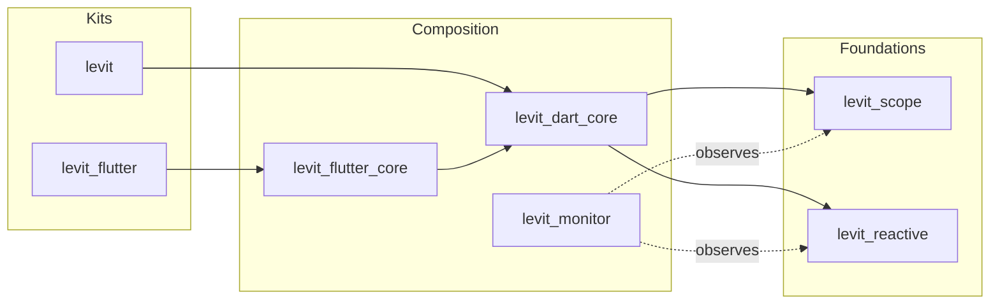

# Levit

Deterministic reactive architecture for Dart and Flutter.

[](https://opensource.org/licenses/MIT)
[](https://codecov.io/github/atoumbre/levit)

Levit is a layered ecosystem for teams that want explicit ownership, deterministic disposal, and fine-grained reactive updates.

## Installation

### Flutter applications

```bash
flutter pub add levit_flutter
```

### Pure Dart applications (CLI, server, shared domain)

```bash
dart pub add levit
```

## Quick Start

### Pure Dart

```dart
import 'package:levit/levit.dart';

void main() {
  final scope = Levit.createScope('app');

  scope.run(() {
    final count = Levit.put(() => 0.lx, tag: 'count');
    final worker = LxWorker(count, (value) => print('count=$value'));

    count(1);

    worker.close();
  });

  scope.dispose();
}
```

### Flutter

```dart
import 'package:flutter/material.dart';
import 'package:levit_flutter/levit_flutter.dart';

class CounterController extends LevitController {
  final count = 0.lx;
  void increment() => count(count() + 1);
}

class CounterPage extends StatelessWidget {
  const CounterPage({super.key});

  @override
  Widget build(BuildContext context) {
    return LScopedView<CounterController>.put(
      () => CounterController(),
      builder: (context, controller) => Scaffold(
        body: Center(
          child: LWatch(() => Text('Count: ${controller.count()}')),
        ),
        floatingActionButton: FloatingActionButton(
          onPressed: controller.increment,
          child: const Icon(Icons.add),
        ),
      ),
    );
  }
}

void main() => runApp(const MaterialApp(home: CounterPage()));
```

## Ecosystem Overview

### Recommended entry points (kits)

| Package | Use when |
| :-- | :-- |
| [`levit_flutter`](./packages/kits/levit_flutter) | Building Flutter applications |
| [`levit`](./packages/kits/levit) | Building pure Dart applications |

### Core packages

| Package | Responsibility |
| :-- | :-- |
| [`levit_reactive`](./packages/core/levit_reactive) | Reactive primitives, computed values, workers, batching |
| [`levit_scope`](./packages/core/levit_scope) | Hierarchical dependency injection and deterministic lifecycles |
| [`levit_dart_core`](./packages/core/levit_dart_core) | Composition layer (`Levit`, `LevitController`, `LevitStore`) |
| [`levit_flutter_core`](./packages/core/levit_flutter_core) | Flutter bindings (`LScope`, `LWatch`, `LView`, builders) |
| [`levit_monitor`](./packages/core/levit_monitor) | Structured monitoring and transport pipeline |

## Architecture Model



## Package Boundaries

- `levit_scope` owns dependency registration, resolution, and disposal rules.
- `levit_reactive` owns change propagation, dependency tracking, and reactive middleware.
- `levit_dart_core` composes both layers and defines controller/store ownership semantics.
- `levit_flutter_core` maps Levit lifecycle and dependency context to Flutter widget lifecycles.
- `levit_dart` and `levit_flutter` add convenience APIs on top of the core layers.

## Middleware Lifecycle

Token-based registration is the canonical pattern:

- Use one stable token per concern.
- Re-register with the same token to replace behavior in place.
- Remove by token during feature teardown.

Reference docs:

- DI middleware lifecycle: [`packages/core/levit_scope/README.md`](./packages/core/levit_scope/README.md)
- Reactive middleware lifecycle: [`packages/core/levit_reactive/README.md`](./packages/core/levit_reactive/README.md)
- Unified facade lifecycle: [`packages/core/levit_dart_core/README.md`](./packages/core/levit_dart_core/README.md)

## Documentation Contract

- Inline DartDoc on public APIs is the authoritative API reference.
- Package READMEs document package scope, architecture role, and onboarding.
- This root README documents ecosystem-level architecture and adoption guidance.

## Examples

Example applications live in [`examples/`](./examples):

- [`examples/task_board`](./examples/task_board)
- [`examples/async_catalog`](./examples/async_catalog)
- [`examples/scope_playground`](./examples/scope_playground)
- [`examples/nexus_studio`](./examples/nexus_studio)

## Contributing

```bash
melos bootstrap
melos test
```

See [`CONTRIBUTING.md`](./CONTRIBUTING.md) for workflow details.
