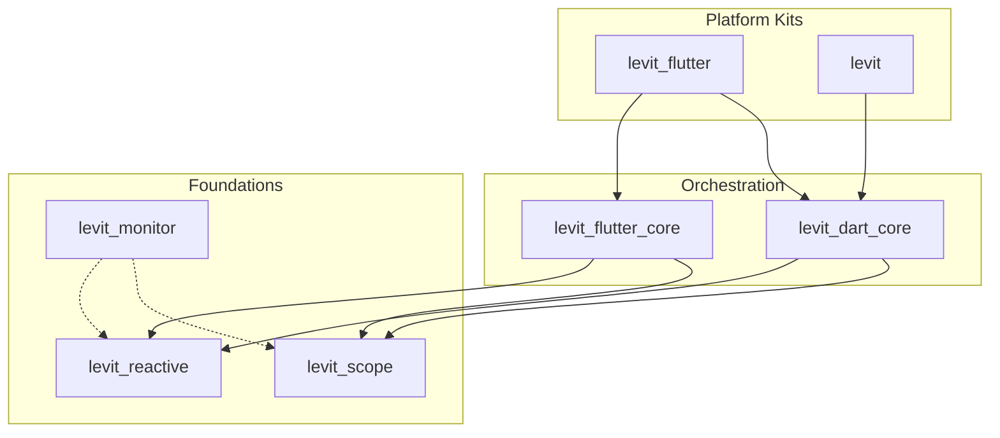

# Levit

**A deterministic reactive foundation for Flutter and Dart.**
Lean by design. Fast by default. Explicit by choice.

[](https://opensource.org/licenses/MIT)
[](https://codecov.io/github/atoumbre/levit)

Levit is a **modular, deterministic reactive foundation** that combines:

* fine-grained synchronous reactivity
* hierarchical dependency injection
* explicit bindings to the Flutter widget tree

It is designed for teams who value **predictability, performance, and architectural clarity** over implicit magic, hidden lifecycles, or global side effects.

Levit does **not** attempt to abstract Flutter away.
It gives you **precise control** over *when*, *where*, and *why* state changes propagate.


## Installation

### Flutter Applications

Use the Flutter kit for UI, reactivity, DI, and widget bindings.

```bash
flutter pub add levit_flutter
```

### Pure Dart (Logic, CLI, Server)

For shared logic, domain layers, or backend services.

```bash
dart pub add levit
```


## Quick Start — *The Levit Way*

Levit enforces a clear separation between:

* **Services** — side effects and I/O
* **Controllers** — business logic and state orchestration
* **Views** — deterministic bindings to reactive state

```dart
// 1. Service: external data or side-effects
class WeatherService {
  Future<double> fetchTemperature() async => 22.5; 
}

// 2. Controller: state + reactivity
class WeatherController extends LevitController
    with LevitReactiveTasksMixin {

  final _service = Ls.find<WeatherService>();

  // Fine-grained reactive state
  final temperature = 0.0.lx;

  Future<void> refresh() async {
    // Built-in task lifecycle (loading / error / cancellation)
    await runTask(() async {
      temperature.value = await _service.fetchTemperature();
    });
  }
}

// 3. View: explicit, deterministic binding
class WeatherPage extends LScopedView<WeatherController> {
  const WeatherPage({super.key});

  @override
  WeatherController createController() => WeatherController();

  @override
  Widget buildContent(BuildContext context, WeatherController controller) {
    return Scaffold(
      body: Center(
        child: LWatch(
          () => Text('Temp: ${controller.temperature.value}°C'),
        ),
      ),
      floatingActionButton: FloatingActionButton(
        onPressed: controller.refresh,
        child: const Icon(Icons.refresh),
      ),
    );
  }
}
```

No code generation.
No implicit listeners.
No hidden rebuilds.


## Ecosystem Overview

Levit is a **layered ecosystem**, not a monolith.
You can adopt it incrementally — from low-level reactivity to full application architecture.

### Platform Kits (Recommended Entry Points)

| Package                                              | Description                                              | Version                                                                                      |
| :--------------------------------------------------- | :------------------------------------------------------- | :------------------------------------------------------------------------------------------- |
| **[`levit_flutter`](./packages/kits/levit_flutter)** | **Flutter apps.** Complete UI + logic toolkit.           | [](https://pub.dev/packages/levit_flutter) |                |
| **[`levit_dart`](./packages/kits/levit_dart)**       | **Advanced utilities.** Tasks, loops, execution helpers. | [](https://pub.dev/packages/levit_dart)       |

### Core Foundations (Composable Primitives)

| Package                                                        | Description                                                | Version                                                                                                |
| :------------------------------------------------------------- | :--------------------------------------------------------- | :----------------------------------------------------------------------------------------------------- |
| **[`levit_reactive`](./packages/core/levit_reactive)**         | Reactive engine (Lx). Deterministic, batched, synchronous. | [](https://pub.dev/packages/levit_reactive)         |
| **[`levit_scope`](./packages/core/levit_scope)**               | Hierarchical dependency injection and lifecycles.          | [](https://pub.dev/packages/levit_scope)               |
| **[`levit_dart_core`](./packages/core/levit_dart_core)**       | Controllers, state orchestration, DI glue.                 | [](https://pub.dev/packages/levit_dart_core)       |
| **[`levit_flutter_core`](./packages/core/levit_flutter_core)** | Flutter bindings (`LView`, `LScope`, `LWatch`).            | [](https://pub.dev/packages/levit_flutter_core) |
| **[`levit_monitor`](./packages/core/levit_monitor)**           | Unified observability and diagnostic event bus.            | [](https://pub.dev/packages/levit_monitor)           |


## Strategic Advantages

### 1. No Code Generation

Levit relies on Dart’s type system and extensions.
No build steps. No generated files. No tooling lock-in.


### 2. Deterministic Observability

With `levit_monitor`, **every** state mutation, dependency resolution, and lifecycle event is emitted as a structured signal.

This enables:

* advanced debugging
* telemetry
* state replay
* time-travel inspection


### 3. True Hierarchical DI

Scopes are **explicit and nested**, not global.

Dependencies:

* are created lazily
* are disposed deterministically
* cannot accidentally outlive their scope

This eliminates a large class of memory and lifecycle bugs common in navigation-heavy apps.


### 4. Synchronous Batched Reactivity

Reactive mutations are grouped into a single transaction.

* Multiple state updates
* One propagation pass
* One rebuild

This guarantees **stable performance**, even under heavy mutation.


## Architecture at a Glance




## Contributing

Levit is built as a **long-term foundation**, and contributions are welcome.

```bash
melos bootstrap
melos run test
cd benchmarks && flutter run -t lib/main.dart
```

See [CONTRIBUTING.md](CONTRIBUTING.md) for guidelines.


