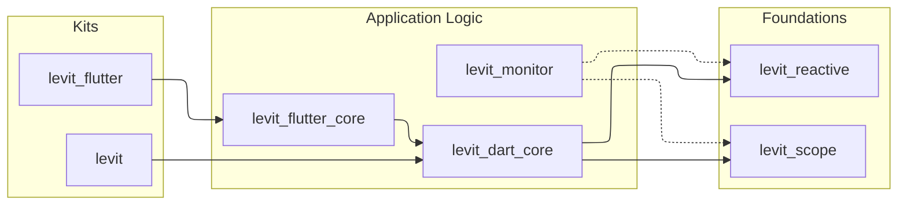

# Levit

**A deterministic reactive foundation for Dart and Flutter.**
Lean by design. Fast by default. Explicit by choice.

[](https://opensource.org/licenses/MIT)
[](https://codecov.io/github/atoumbre/levit)

Levit is a layered ecosystem that combines:
- Fine-grained synchronous reactivity (`levit_reactive`)
- Hierarchical dependency injection with deterministic lifecycles (`levit_scope`)
- Explicit Flutter widget bindings (`levit_flutter_core`)

It is designed for teams that value predictable lifecycles and explicit boundaries over implicit global state and hidden subscriptions.

## Installation

### Flutter Applications

```bash
flutter pub add levit_flutter
```

### Pure Dart (Logic, CLI, Server)

```bash
dart pub add levit
```

## Quick Start

### Pure Dart

```dart
import 'package:levit/levit.dart';

void main() {
  final count = 0.lx;
  final log = LxWorker(count, (v) => print('count: $v'));

  final scope = Levit.createScope('app');
  scope.put(() => count, tag: 'count');

  count(1);

  log.close();
  count.close();
  scope.dispose();
}
```

### Flutter

```dart
import 'package:flutter/material.dart';
import 'package:levit_flutter/levit_flutter.dart';

class CounterController extends LevitController {
  final count = 0.lx;
  void increment() => count(count() + 1);
}

class CounterPage extends LScopedView<CounterController> {
  const CounterPage({super.key});

  @override
  CounterController createController() => CounterController();

  @override
  Widget buildContent(BuildContext context, CounterController controller) {
    return Scaffold(
      body: Center(child: LWatch(() => Text('Count: ${controller.count()}'))),
      floatingActionButton: FloatingActionButton(
        onPressed: controller.increment,
        child: const Icon(Icons.add),
      ),
    );
  }
}

void main() => runApp(const MaterialApp(home: CounterPage()));
```

## Ecosystem Overview

Levit is modular and can be adopted incrementally.

### Kits (Recommended Entry Points)

| Package                                      | Use case |
| :------------------------------------------- | :------- |
| [`levit_flutter`](./packages/kits/levit_flutter) | Flutter applications |
| [`levit`](./packages/kits/levit)                 | Pure Dart applications and shared domain layers |

### Core Packages

| Package                                            | Responsibility |
| :------------------------------------------------- | :------------- |
| [`levit_reactive`](./packages/core/levit_reactive) | Reactive state primitives and dependency tracking |
| [`levit_scope`](./packages/core/levit_scope)       | Dependency injection and deterministic lifecycles |
| [`levit_dart_core`](./packages/core/levit_dart_core) | Composition layer for controllers and stores |
| [`levit_flutter_core`](./packages/core/levit_flutter_core) | Flutter widget bindings for scopes and reactive rebuilds |
| [`levit_monitor`](./packages/core/levit_monitor)   | Monitoring and diagnostics event pipeline |

## Architecture at a Glance



## Contributing

```bash
melos bootstrap
melos run test
cd benchmarks && flutter run -t lib/main.dart
```

See [CONTRIBUTING.md](CONTRIBUTING.md) for guidelines.
