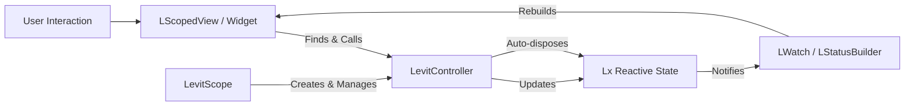
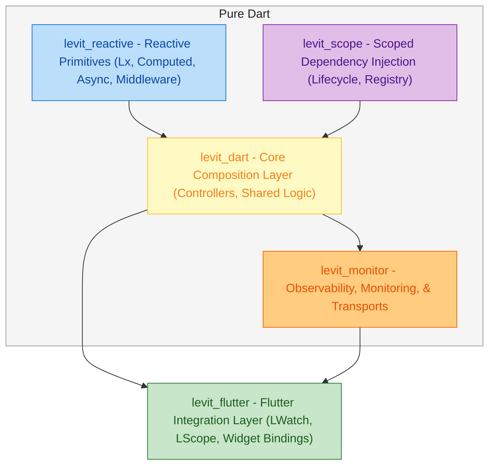

# Levit

**A deterministic reactive foundation for Flutter.**
Lean by design. Fast by default. Explicit by choice.

[](https://opensource.org/licenses/MIT)
[](https://codecov.io/github/atoumbre/levit)

Levit is a **modular reactive foundation for Flutter** that combines fine-grained reactivity, hierarchical dependency injection, and explicit widget-tree bindings.

It is built for teams and individuals who value **predictability, performance, and architectural clarity** over hidden abstractions and implicit behavior.

> **Note**
> This repository is the monorepo for the entire Levit ecosystem.

---

## Installation

```yaml
dependencies:
  levit_flutter: ^latest
```

or

```bash
flutter pub add levit_flutter
```

---

## Quick Start

Levit encourages explicit layering: services, controllers, and UI each have a clear responsibility.

```dart
// 1. Service: external data source
class AuthService {
  Stream<Session> get sessionStream => Stream.periodic(
    const Duration(seconds: 1),
    (i) => Session(
      user: User(name: 'User $i', lastActive: DateTime.now()),
    ),
  );
}

// 2. Controller: state and derivations
class DashboardController extends LevitController {
  final _authService = Levit.find<AuthService>();

  // Reactive stream with built-in loading / error handling
  final session = _authService.sessionStream.lx;

  // Derived value, recomputed only when dependencies change
  final currentUser = (() => session.valueOrNull?.user).lx;

  // Further derivation with fine-grained update semantics
  final lastActive = (() => currentUser.value?.lastActive).lx;
}

// 3. UI: lifecycle + binding
class DashboardPage extends LScopedView<DashboardController> {
  const DashboardPage({super.key});

  @override
  DashboardController createController() => DashboardController();

  @override
  Widget buildContent(BuildContext context, DashboardController controller) {
    return Scaffold(
      body: Center(
        child: Text(
          'Last Active: ${controller.lastActive.value}',
          style: Theme.of(context).textTheme.headlineMedium,
        ),
      ),
    );
  }
}
```

Levit handles:

* Dependency resolution
* Controller lifecycle
* Precise widget rebuilds

—all without code generation or implicit magic.

---

## Conceptual Overview



Levit’s data flow is explicit, deterministic, and easy to reason about—even under heavy mutation or async workloads.

---

## What Levit Is

Levit is a **low-level reactive foundation** for Flutter applications that require:

* Predictable update semantics
* Performance under scale
* Explicit lifecycles and scoping
* Long-term maintainability in complex systems

While it integrates deeply with Flutter, Levit is not Flutter-exclusive.
The same reactive and DI primitives are usable in **pure Dart**, including servers, CLI tools, and tests.

---

## Why Levit

Many Flutter state solutions prioritize convenience.
Levit prioritizes **correctness, control, and transparency**.

### Fine-Grained Reactivity

Any value can become reactive via `.lx`.
Dependencies are tracked automatically and precisely—no annotations, no code generation.

### Deterministic Rebuilds

`LWatch` rebuilds **only** when the specific reactive values it consumes change.
No broad invalidation. No unexpected redraws.

### Explicit Scoping and DI

A single, coherent model supports:

* Global access (`Levit.find`)
* Widget-tree scoping (`LScope`, `context.find`)
* Predictable lifecycle management

### Async as a First-Class Concern

Futures and Streams integrate directly into the reactive graph through `LxStatus`, with built-in:

* Loading and error states
* Cancellation and race handling
* Lifecycle awareness

Levit gives you the primitives to model state, derivations, and effects precisely—then stays out of your way.

---

## What Levit Is Not

* **A batteries-included application framework**
  Levit provides the engine, not the entire vehicle.

* **A beginner-oriented abstraction layer**
  The API favors clarity over concealment. It is designed for professional, scalable architectures.

* **A replacement for Flutter widgets**
  Levit integrates with Flutter’s widget model rather than obscuring it.

These boundaries are deliberate.

---

## Architectural Layers

Levit is intentionally layered and composable, with each layer addressing a distinct architectural concern while remaining fully usable in isolation. At the foundation, levit_reactive provides a platform-agnostic reactivity engine written entirely in pure Dart. Alongside it, levit_scope delivers a pure Dart, scoped, and type-safe dependency injection system with explicit lifecycle management, independent of any UI framework. These two primitives are composed and exposed through levit_dart, which acts as the canonical core for shared logic and non-UI environments. levit_monitor provides observability, monitoring, and transport layers for inspection. Finally, levit_flutter integrates the Levit core with Flutter’s widget tree, bridging reactivity and dependency injection without altering Flutter’s mental model or replacing its widgets. Together, these layers form a cohesive system while remaining independently consumable as building blocks.


---

## Packages

| Package                                             | Description                                                                                  | Version                                                                                          |
| --------------------------------------------------- | -------------------------------------------------------------------------------------------- | ------------------------------------------------------------------------------------------------ |
| **[`levit_dart`](./packages/levit_dart)**       | Core framework for pure Dart. Aggregates DI and Reactivity.                                  | [](https://pub.dev/packages/levit_dart)         [](https://codecov.io/github/atoumbre/levit?flags=levit_dart)           |
| **[`levit_reactive`](./packages/levit_reactive)** | Pure Dart reactive core: primitives (`Lx`), computed values, async handling, and middleware. | [](https://pub.dev/packages/levit_reactive) [](https://codecov.io/github/atoumbre/levit?flags=levit_reactive) |
| **[`levit_scope`](./packages/levit_scope)**             | Hierarchical, type-safe dependency injection and service registry.                           | [](https://pub.dev/packages/levit_scope)             [](https://codecov.io/github/atoumbre/levit?flags=levit_scope)             |
| **[`levit_flutter`](./packages/levit_flutter)**   | Flutter bindings: `LWatch`, `LScope`, and widget lifecycle integration.       | [](https://pub.dev/packages/levit_flutter)   [](https://codecov.io/github/atoumbre/levit?flags=levit_flutter)   |
| **[`levit_monitor`](./packages/levit_monitor)**   | Observability, monitoring, and transport layers.    | [](https://pub.dev/packages/levit_monitor) [](https://codecov.io/github/atoumbre/levit?flags=levit_monitor)    |


## Community and Contributions

Levit is early-stage and evolving, with a strong emphasis on **design correctness and long-term stability**.

Contributions are especially welcome in:

* Documentation and examples
* Benchmark validation
* Real-world integration patterns

### Contributing

1. Fork and clone the repository
2. Activate Melos: `dart pub global activate melos`
3. Bootstrap the workspace: `melos bootstrap`
4. Explore the `packages/` directory
5. Submit a PR with improvements or proposals

If something is unclear, open an issue.
Levit is developed in the open, and feedback directly influences its direction.

Please review the [Contribution Guidelines](CONTRIBUTING.md) for details on the process and code of conduct.

